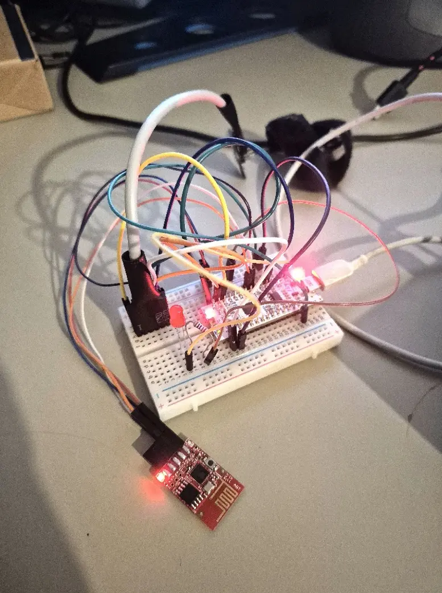
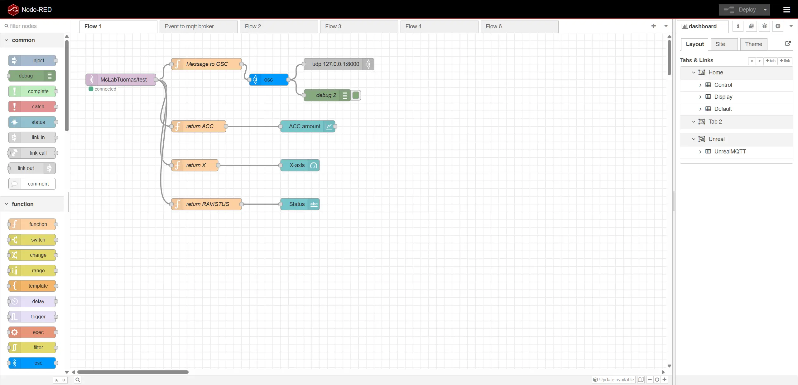
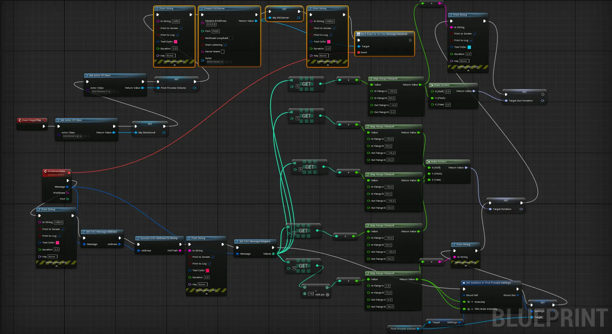
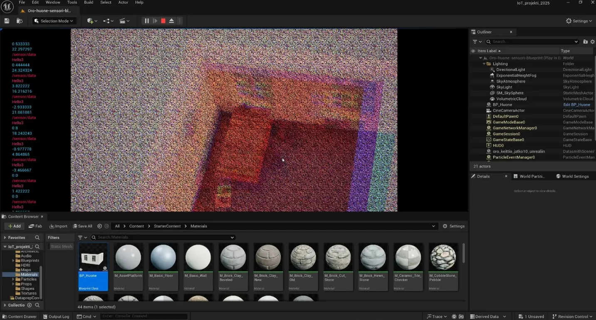
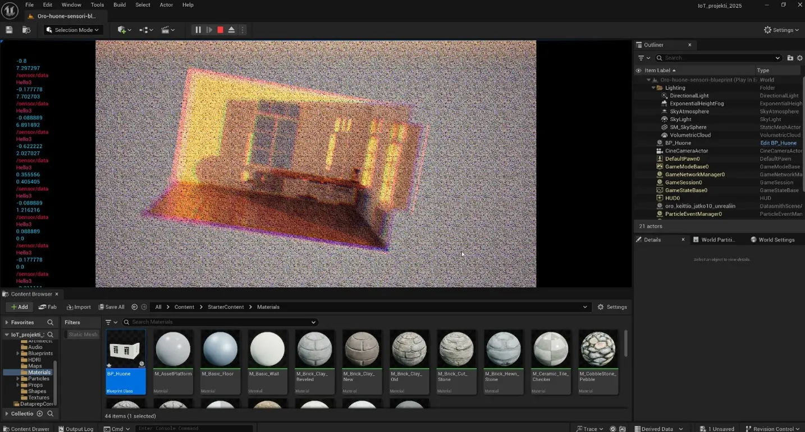

# Interactive IoT Unreal Engine Installation

A prototype for an interactive video game installation. This project uses a physical microcontroller and an accelerometer to control a 3D environment, lighting, and post-processing effects in Unreal Engine 5 in real-time.

  
  &nbsp;&nbsp;&nbsp;&nbsp;
   
   
  <i>Left: Real-time room rotation. Right: The custom NUCLEO-L432KC hardware setup.</i>

## System Architecture

The project is built using an end-to-end IoT architecture divided into three main components:

1. **Embedded System (Hardware & Firmware):** A NUCLEO-L432KC microcontroller reads movement data (X, Y, Z axes, and total acceleration) from a Digilent PmodACL2 (ADXL362) sensor. The C++ firmware utilizes Mbed OS and multithreading to separate the sensor reading processes from network latency.
2. **IoT Gateway & Data Processing:** The hardware packages the sensor data into JSON and sends it via an ESP8266 Wi-Fi module over MQTT. A Node-RED platform subscribes to this MQTT topic, visualizes the data on a dashboard, and translates the JSON data into OSC (Open Sound Control) messages.
    

        
         
        <i>NodeRED flow setup</i>
    

3. **Game Engine Visualization:** Unreal Engine 5 listens for UDP/OSC traffic. Blueprint scripts map and interpolate the incoming sensor data to drive smooth, real-time changes in the 3D environment:
   * **Room Rotation:** Controlled by X/Y/Z axes.
   * **Sun/Lighting (Directional Light):** Reacts to the Y-axis movement.
   * **Post-Process Effects:** Chromatic Aberration and Film Grain react to the total acceleration intensity (e.g., shaking the device).

  
   
  <i>Blueprint logic scaling and interpolating incoming OSC sensor data to drive real-time room rotation.</i>

  
  &nbsp;&nbsp;&nbsp;&nbsp;
   
   
  <i>Unreal Engine post-process effects that activate when the sensor is shaken.</i>

## Technologies Used

* **Hardware:** NUCLEO-L432KC, MOD-WIFI-ESP8266, Digilent PmodACL2 (ADXL362)
* **Firmware:** C++, Mbed OS 
* **Protocols:** MQTT (Mosquitto Broker), OSC, UDP
* **Software:** Node-RED, Unreal Engine 5 (Blueprints)

## Key Technical Challenges Solved

* **Latency Optimization:** Switched from a public MQTT broker to a local Mosquitto `localhost` broker to minimize network delay. Adjusted the thread sleep times in the C++ firmware to improve responsiveness.
* **Connection Stability:** Implemented `client.yield()` functions in the firmware to maintain a stable connection with the MQTT broker during continuous data streaming.
* **Data Smoothing:** Used `Map Range` and `RInterp To` nodes in Unreal Engine to interpolate the raw 8-bit sensor data into smooth 3D rotations.

## Repository Structure

* `/firmware`: C++ source code for the NUCLEO microcontroller.
* `/node-red`: Exported Node-RED flows (`.json`) for MQTT to OSC translation.
* `/unreal-project`: The UE5 project files (Blueprints, Materials, DataSmith imports).